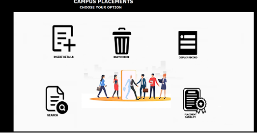
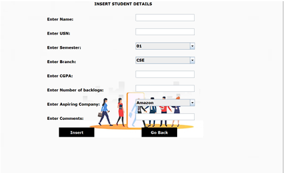
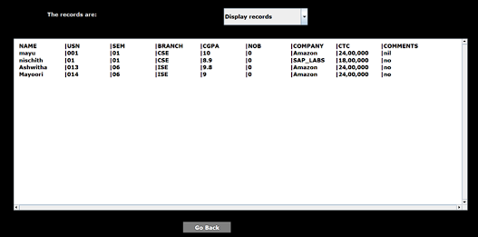
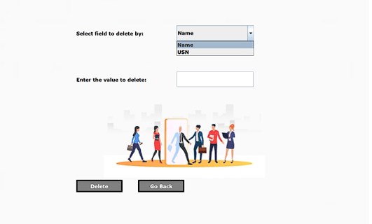
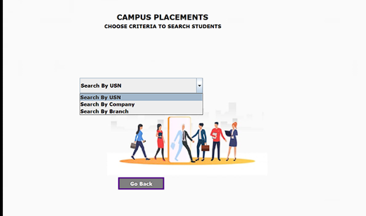
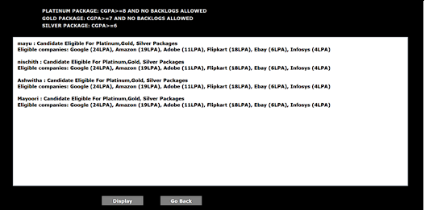

# PLACEMENT MANAGEMENT SYSTEM

Placement Management System is built using Java Swing Library, it is a fast-flexible file
computer system that helps manage the information related to college student placement
database effectively. They manage the data related to all student academic details concerned
with campus placements for the campus placement drive which is conducted annually.
Placement Management system is a software application built for campus placement and
training department for accessing student details and making further placement process easier.
Placement Management System offers the following functionalities:

- Adding and Modifying new Student Records: New student records can be added and
  modified.
- Deleting Existing Records: Existing student records can be deleted.
- Search: Allows users to search existing student records by various categories like search
  student details by USN, Branch, Company.
- Display: All records in the system can be displayed.
- Ledger: Using General Ledger Problem, all modifications made are displayed
- Eligibility: Placement eligibility of all students can be viewed where each student details are
  displayed according to their eligibility criteria and which company they are eligible to.

---

# Typical Features include:

- Insert/Modify Student Records – This system helps the placement team to insert each student
record once and update it timely, and store it for further usages during placements, segregating
students based on their CGPA, their interests and aspirations based on the eligibility criteria.
- Delete Student Records – This system enables options of deleting existing student records, or
wrongly entered student record.
- Eligibility View – As a part of final consolidated view this system provides a view of student
where each student’s eligibility criteria is checked and corresponding eligible companies are
displayed.
- View Changes – We have an option to view each and every changes done to each record from
the time of insertion followed by any number of modifications done to the record.
- Searching Student record – As with placement system will always want to categorise students
and view particular set of records at a time, this system enables such features by providing
variety of search categories namely search by USN, search by branch, search by company.

Placement Management System provides a clear picture of all students where they stand in terms of
placement eligibility criteria and which companies they are eligibility to, it provides an efficient
search feature to the user which helps the placement handling team to search records of student by
their USN, or set of records by each branch, or by the company name.

---

Go through Reports to understand more
It has complete information regarding the project and its Implementation

---

# SCHEMA DIAGRAM

---

# APPLICATION
 
 This is the main page that is displayed while running the code 

 
-Inserting the student details.
 
 
 
 
